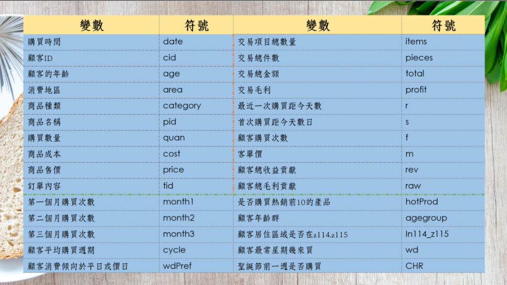

<hr>

### part 1 交易項目計錄：

```{r echo=T, message=F, cache=F, warning=F}
rm(list=ls(all=T))
Sys.setlocale("LC_TIME","C")
pacman::p_load(magrittr, readr, caTools, ggplot2, dplyr)
```

##### 1.1 資料匯入

```{r}
A = read_csv("data/ta_feng_all_months_merged.csv") %>%
  data.frame %>% 
  setNames(c("date","cid","age","area","category","pid","quan","cost","price"))
nrow(A)
```

##### 資料格式整理
```{r}
A$date = as.Date(A$date, format ="%m/%d/%Y") 
A$age[is.na(A$age)] = "na"
A$age = factor(A$age, levels=c(
  "<25","25-29","30-34","35-39","40-44","45-49","50-54","55-59","60-64",">65","na"), labels=c(
  "a20","a25","a30","a35","a40","a45","a50","a55","a60","a65","na"
  )) %>% as.character
A$area = paste0("A",A$area)
summary(A)
```

##### 處理outlier
```{r}
sapply(A[,7:9], quantile, prob=c(.99, .999, .9995)) #把數量、成本及售價離群處理掉
A = subset(A, quan<=24 & cost<=3800 & price<=4000)

nrow(A) #減少559
```

##### 彙總訂單 Assign Transaction ID
```{r}
A$tid = group_indices(A, date, cid) # same customer same day
```

##### 資料簡易分析
```{r}
sapply(A[c("cid","category","pid","tid")], n_distinct)
```

<br><br><hr><br>

### part 2 交易紀錄 : 以每筆交易訂單tid為主軸

```{r}
B = A %>% group_by(tid) %>%
  summarise(
  date = date[1],             # 交易日期  
  cid = cid[1],               # 顧客 ID
  age = age[1],               # 顧客 年齡級別
  area = area[1],             # 顧客 居住區別
  items = n(),                # 交易項目(總)數
  pieces = sum(quan),         # 產品(總)件數
  total = sum(price),         # 交易(總)金額
  profit = sum(price - cost)  # 毛利
  ) %>% data.frame
summary(B)
```

##### 處理outlier
```{r}
sapply(B[,6:9], quantile, prob=c(.99, .9995, .9999)) #把數量、成本及售價離群處理掉
B = subset(B, items<=62 & pieces<95 & total<16000)

nrow(B) #119422-119328=94 減少94
```

#### 每週交易次數
```{r}
par(cex=0.8)
hist(B$date,"weeks" ,freq=T, las=2, main="No. Transaction per Week")
```

<br><br><hr><br>

### part 3 建立顧客資料 "C"


```{r}
d0 = max(B$date) + 1
C = B %>% mutate(
  days = as.integer(difftime(d0, date, units="days"))
  ) %>% 
  group_by(cid) %>% summarise(
    r = min(days),      # recency
    s = max(days),      # seniority
    f = n(),            # frquency
    m = mean(total),    # monetary
    rev = sum(total),   # total revenue contribution
    raw = sum(profit),  # total gross profit contribution
    age = age[1],       # age group
    area = area[1]      # area code
  ) %>% data.frame      # 33241
nrow(C)
```

##### 顧客摘要
```{r}
summary(C)
```

```{r}
par(mfrow=c(3,2), mar=c(3,3,4,2))
for(x in c('r','s','f','m')) 
  hist(C[,x],freq=T,main=x,xlab="",ylab="",cex.main=2)
hist(pmin(C$f,10),0:10,freq=T,xlab="",ylab="",cex.main=2)
hist(log(C$m,10),freq=T,xlab="",ylab="",cex.main=2)
```


##### 儲存各個資料集

```{r}
is.na(A) %>% colSums
is.na(B) %>% colSums
is.na(C) %>% colSums
```


```{r}
A0 = A; B0 = B; C0 = C
save(A0,B0,C0, file="data/tf0.rdata")
```

<br><br><hr><br>

### part 4 切割資料準備


```{r}
rm(list=ls(all=TRUE))
Sys.setlocale("LC_TIME","C")
pacman::p_load(magrittr, readr, caTools, ggplot2, dplyr)
load("data/tf0.rdata")
```

#####  以二月為分割時間，切割出二月前的資料

```{r}
feb01 = as.Date("2001-02-01")
Z = subset(A0, date < feb01)   
```

```{r}
X = group_by(Z, tid) %>% summarise(
  date = first(date),  # 交易日期
  cid = first(cid),  # 顧客 ID
  age = first(age),    # 顧客 年齡級別
  area = first(area),  # 顧客 居住區別
  items = n(),        # 交易項目(總)數
  pieces = sum(quan),          # 產品(總)件數
  total = sum(price),         # 交易(總)金額
  gross = sum(price - cost)   # 毛利
  ) %>% data.frame 
summary(X)
```

#####  去除outlier
```{r}
sapply(X[,6:9], quantile, prob=c(.999, .9995, .9999))
X = subset(X, items<=64 & pieces<=98 & total <= 11260) # 88387 -> 88295
```

```{r}
d0 = max(X$date) + 1
A = X %>% mutate(
  days = as.integer(difftime(d0, date, units="days"))
  ) %>% 
  group_by(cid) %>% summarise(
    r = min(days),      # recency
    s = max(days),      # seniority
    f = n(),            # frquency
    m = mean(total),    # monetary
    rev = sum(total),   # total revenue contribution
    raw = sum(gross),   # total gross profit contribution
    age = age[1],   # age group
    area = area[1]    # area code
  ) %>% data.frame      
nrow(A)
```

<br>

### part 5 衍生變數


##### 所有變數列表
<center>



</center>

##### 前10個熱銷產品分別購買次數

+ hotprod
以是否有購買產品熱銷前10的產品做為區隔，
看出購買這些產品的人是否為特定族群或者有其他的特性


+ 用`xtabs()`做顧客產品矩陣
  + row: customer
  + col: product
```{r}
library(Matrix)
library(slam)

Z = subset(Z, cid %in% A$cid)
cpm = xtabs(~ cid + pid, Z, sparse=T)
```

刪除購買次數小於10的產品
```{r}
table(colSums(cpm) < 10)       # 9652
cpm = cpm[, colSums(cpm) > 10]   
cpm = cpm[, order(-colSums(cpm))]   # order product by frequency
dim(cpm)                       # 28584  9159
```

確認cpm和A的顧客順序及大小是否有相同
```{r}
cpm = cpm %>% as.matrix
(A$cid == rownames(cpm)) %>% sum
```

合併兩個資料並將欄位名稱變更
```{r}
A = cbind(A,cpm[,1:10])

colnames(A)[10:19] = sapply(seq(1,10,1), function(x){
  names = paste0("p",x)
})
```


##### 顧客年齡群

藉由將原本age裡的年齡層做重新分類，<br>
35歲以下的為青年人口，<br>
35歲到50歲之間為中年人口，<br>
50歲以上則為老年人口，<br>
藉由重新分群的方式，能更清楚看出各個年齡層之間的消費情況，來訂出策略<br>


+ 將顧客年齡區分為
  + 35歲以下（=1）
  + 35到50歲（=2）
  + 50歲以上三群（=3）
+ 設為新的因素欄位`ageGroup`
```{r}
A$ageGroup<- as.factor(A$age)
A$ageGroup<-factor(A$ageGroup, levels=c("a20", "a25", "a30", "a35","a40", "a45", "a50", "a55", "a60", "a65", "na"), labels=c("A1", "A1", "A1", "A1", "A2", "A2", "A2", "A3", "A3", "A3", "na"))
```

##### 聖誕節購買幾次

找出聖誕節前一週的區間
```{r}
CHR1 = as.Date("2000-12-17")
CHR2= as.Date("2000-12-23")
# as.Date("2000-12-25") %>% format("%U")
```

+ 依照顧客做分群設立新變數聖誕節前一週購買次數(CHR)
  + 將所有交易時間與該區間進行比較，若有購買則為1,若非則為0
```{r}
NewVar = group_by(X, cid) %>% 
  summarise(
    CHR = sum( ifelse(date > CHR1 & date < CHR2, 1, 0 ) )
  )
```

合併資料
```{r}
A = left_join(A, NewVar)
```


##### 消費者消費傾向於平日或假日

+ 用`xtab()`做出一個矩陣，每個值代表該顧客在每個星期購買幾次
  + row: customer
  + col: weekday
+ 把每個值除以該列總和，則變為機率: (該顧客在每個星期購買的機率)
+ 變成data.frame，並新增wk15 & wk67欄位
  + wk15: 平日購買的機率
  + wk67: 假日購買的機率
```{r}
X = X %>% mutate(wday = format(date, "%w"))

mx = xtabs(~ cid + wday, X)
dim(mx)

mx = mx / rowSums(mx)  # count -> probability

W = data.frame(as.character(rownames(mx)), as.matrix.data.frame(mx)) %>% 
  setNames(c("cust","W7","W1","W2","W3","W4","W5","W6")) %>% 
  mutate(
    wk15 = W1+W2+W3+W4+W5,
    wk67 = W6+W7
  )
```

+ 判斷顧客可能比較會在平日or假日購買
  + na代表沒有特別偏好
```{r}
W$wdPref = ifelse((W$wk15 < W$wk67), "Weekend",
         ifelse(W$wk15 == W$wk67, "Na", "Weekday"))
W$wdPref = as.factor(W$wdPref)
```

合併資料
```{r}
A = merge(A, W[,c("cust","wdPref")], by.x="cid", by.y="cust")
```

##### 顧客最常星期幾來買(wd)

+ 自定義一個計算的function `maxWeekday`，待會在summarise時可以使用
+ na: 表示沒有特別偏好星期幾
+ 步驟:
  + 先把每筆交易日期取簡寫的星期(%a)
  + 用table()計算出每個星期的交易次數
  + 用ifelse()判斷，如果沒有哪個星期交易量特別大則為"na"，如果有則取出最常交易的星期
```{r}
maxWeekday = function(x){
  y = format(x,"%a") %>% table
  d = ifelse(sum(y==max(y))>1, "na", names(which.max(y)))
  return(d)
}
```

##### 其他衍生變數

+ month1/month2/month3

我們以月分做為區隔，把顧客在這三個月裡的購買次數個別加總，藉由觀察各個月的購買次數來看出顧客消費趨勢的變化

```{r}
NewVar = group_by(X, cid) %>% 
  summarise(
    weekday = maxWeekday(date),                                                   # 顧客最常禮拜幾來買
    avgPrice = mean(total / pieces),                                              # 商品平均單價
    mon1 = sum(date < as.Date("2000-12-01")),                                     # 第一個月購買的次數
    mon2 = sum((date < as.Date("2001-01-01") & (date >= as.Date("2000-12-01")))), # 第二個月購買的次數
    mon3 = sum(date >= as.Date("2001-01-01")),                                    # 第三個月購買的次數
    in114_115 = ifelse(area[1] %in% c("A114", "A115"), T, F)                    # 居住區域是否在A114.A115
  ) %>% data.frame    # 28584
```

幫weekday排順序
```{r}
NewVar$weekday = factor(NewVar$weekday, levels= c("Mon", "Tue", "Wed", "Thu", "Fri", "Sat", "Sun", "na"))
```


+ cycle
利用消費者最近購買的日期減去最久購買的日期除以購買次數所得到顧客平均購買週期，
希望藉由每個顧客平均購買週期的區分該顧客是否為常客或者只是路過的遊客，
來看顧客出對於這家店的忠誠度

```{r}
A$cycle = A$s/A$f
```

合併資料
```{r}
A = merge(A, NewVar, all.x = T)
summary(A)
```


<br>

### part 6 準備 (Y)

```{r}
feb = filter(B0, date>= feb01) %>% group_by(cid) %>% 
  summarise(amount = sum(total))
```

##### The Target for Regression - `A$amount`
```{r}
A = merge(A, feb, by="cid", all.x=T)
```

##### The Target for Classification - `A$buy`
```{r}
A$buy = !is.na(A$amount)
```

##### Summary of the Dataset
```{r}
summary(A)
```


##### The Association of Categorial Predictors
```{r fig.height=3, fig.width=7.2}
tapply(A$buy, A$ageGroup, mean) %>% barplot
abline(h = mean(A$buy), col='red')
```

```{r fig.height=3, fig.width=7.2}
tapply(A$buy, A$area, mean) %>% barplot(las=2)
abline(h = mean(A$buy), col='red')
```

```{r fig.height=3, fig.width=7.2}
tapply(A$buy, A$wdPref, mean) %>% barplot(las=2)
abline(h = mean(A$buy), col='red')
```

```{r fig.height=3, fig.width=7.2}
tapply(A$buy, A$weekday, mean) %>% barplot(las=2)
abline(h = mean(A$buy), col='red')
```

```{r fig.height=3, fig.width=7.2}
tapply(A$buy, A$in114_115, mean) %>% barplot(las=2)
abline(h = mean(A$buy), col='red')
```

##### Contest Dataset
```{r}
X = subset(X, cid %in% A$cid & date < as.Date("2001-02-01"))
Z = subset(Z, cid %in% A$cid & date < as.Date("2001-02-01"))
set.seed(2018); spl = sample.split(A$buy, SplitRatio=0.7)
c(nrow(A), sum(spl), sum(!spl))
```

```{r fig.height=3, fig.width=7}
cbind(A, spl) %>% filter(buy) %>% 
  ggplot(aes(x=log(amount))) + geom_density(aes(fill=spl), alpha=0.5)
```


```{r}
A2 = subset(A, buy) %>% mutate_at(c("m","rev","amount"), log10)
n = nrow(A2)
set.seed(2018); spl2 = 1:n %in% sample(1:n, round(0.7*n))
c(nrow(A2), sum(spl2), sum(!spl2))
```

```{r fig.height=3, fig.width=7}
cbind(A2, spl2) %>% 
  ggplot(aes(x=amount)) + geom_density(aes(fill=spl2), alpha=0.5)
```


```{r}
save(Z, X, A, spl, spl2, file="data/tf2.rdata")
```

<br><br><hr>


