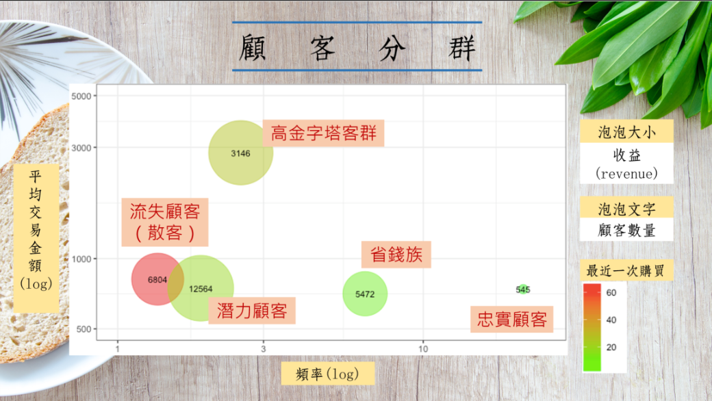

##### Setup 

在進行分析之前，先安裝以下基本套件

```{r}
packages = c(
  "dplyr","ggplot2","googleVis","devtools","magrittr","caTools","ROCR","caTools")
existing = as.character(installed.packages()[,1])
for(pkg in packages[!(packages %in% existing)]) install.packages(pkg)

if(!is.element("chorddiag", existing))
  devtools::install_github("mattflor/chorddiag")

```

##### Library
```{r echo=T, message=F, cache=F, warning=F}
rm(list=ls(all=T))
options(digits=4, scipen=12)
load("data/tf2.rdata")
load("data/tf3.rdata")
library(dplyr)
library(ggplot2)
library(caTools)
library(ROCR)
library(googleVis)
library(chorddiag)
```
<br><hr>


### 2. 層級式集群分析

##### 2.1 K-means顧客分群

在此我們用的是集群式分析k-means，將資料依照不同屬性將顧客做分群。
k-means分完群會把分群的向量放在"cluster"這個欄位裡面，用table(D$grp)看族群大小。

**RFM**

+ 觀察出來，分成5群是最能進行行銷策略且有明顯群間差距的分群方式


```{r}
set.seed(111)

D$grp = D %>% 
  select(r,s,f,m,rev,raw, starts_with("p"), avgPrice, cycle, mon1, mon2, mon3) %>% 
  scale %>% 
  kmeans(., 5) %>% 
  .$cluster
# D$grp = kmeans(scale(D[,2:4]),10)$cluster

table(D$grp)  # 族群大小
```

```{r fig.height=4.5, fig.width=8}
group_by(D, grp) %>% summarise(
  recent=mean(r), 
  freq=mean(f), 
  money=mean(m), 
  senior=mean(s),
  avgPrice=mean(avgPrice),
  cycle=mean(cycle),
  mon1=mean(mon1),
  mon2=mean(mon2),
  mon3=mean(mon3),
  size=n() ) %>% 
  mutate( revenue = size*money/1000 )  %>% 
  filter(size > 1) %>% 
  ggplot(aes(x=freq, y=money)) +
  geom_point(aes(size=revenue, col=recent),alpha=0.5) +
  scale_size(range=c(4,30)) +
  scale_color_gradient(low="green",high="red") +
  scale_x_log10(limits=c(1,25)) + scale_y_log10(limits=c(500,5000)) +
  geom_text(aes(label = size ),size=3) +
  theme_bw() + guides(size=F) +
  labs(title="Customer Segements",
       subtitle="(bubble_size:revenue_contribution; text:group_size)",
       color="Recency") +
  xlab("Frequency (log)") + ylab("Average Transaction Amount (log)")
```

圖形解析：

+ 將現有顧客分成十群，每個泡泡分別代表一群。

+ 4種屬性，大小、顏色、X軸與Y軸可供判讀。

    + X軸：購買頻率。
    + Y軸：平均交易金額(客單價)。
    + 泡泡大小：反映這群顧客對你的營收貢獻。
    + 泡泡顏色：越紅就代表越久沒來買，可能快要流失了。

+ 可以針對很常來買(頻率高)，買很少(客單價低)，去做行銷策略，擬定對這群顧客增加客單價的方法。

因此，從這些泡泡圖，我們可以知道營收來源主要來自於哪裡。藉此來看出我們的行銷重點應該放在哪一些客群上。

<br><hr>


##### 計算每一群的顧客特性

+ 我們用以下變數區別不同族群的屬性
  + recent（最後一次購買距今天數）
  + senior（第一次購買距今天數）
  + freq（購買次數）
  + money（平均購買金額）
  + profit（平均獲利）
  + avgPrice（購買商品平均單價）
  + in114_115（顧客居住區域是否在z114，z115）
  + cycle（平均多少天購買一次）
  + mon1、mon2、mon3（第一、二、三個月的平均購買次數）
  + hotProd
  + CHR（聖誕節前一週購買次數）

```{r}
K = group_by(D, grp) %>% summarise(
  recent=mean(r), 
  senior = mean(s),
  freq=mean(f), 
  money=mean(m), 
  profit=mean(raw/f),
  avgPrice=mean(avgPrice),
  in114_115=mean(in114_115),
  cycle=mean(cycle),
  mon1=mean(mon1),
  mon2=mean(mon2),
  mon3=mean(mon3),
  hotProd=mean(p1+p2+p3+p4+p5+p6+p7+p8+p9+p10),
  CHR = mean(CHR),
  size=n()
  ) 
K
```

##### 各族群的地區分布

+ grp1忠實顧客主要在115、221與未知，且住在115區的比例為五群中最高
+ Grp4省錢族顧客主要居住在115區和221區

```{r}
ggplot(D, aes(grp, fill=area)) + geom_bar(position="fill")
```

##### 各族群的平日/假日購買偏好

(Na: 沒有特別偏好平日或假日)

+ grp2高金字塔客群與grp3流失顧客（散客）也偏好在週末消費，各佔該族群的四成左右比例
+ grp1忠實顧客偏好在平日消費，約佔該族群的九成。
+ grp4省錢族也偏好在平日消費，佔該群約七成。

```{r}
ggplot(D, aes(grp, fill=wdPref)) + geom_bar(position="fill")
```

##### 各族群的年齡分布

+ grp1忠實顧客的年輕族群偏少，以中、老年族群居多
+ grp2高金字塔族群以年輕+中年族群佔絕大多數，老年族群比例為五群中最低
+ Grp4省錢族中老年族群比例為五群中最高

```{r}
D$ageGroup<-factor(D$age, levels=c("a20", "a25", "a30", "a35","a40", "a45", "a50", "a55", "a60", "a65", "na"), 
                          labels=c("A1" ,  "A1",  "A1",  "A1", "A2",  "A2",  "A2",  "A3",  "A3",  "A3", "na"))

ggplot(D, aes(grp, fill=ageGroup)) + geom_bar(position="fill")
```

<br><hr>


### 3. 顧客分群特徵

##### 3.1 不同客戶群其消費習慣
```{r}
P = group_by(D, grp) %>% summarise(
  size=n(),                          ## 族群大小
  buyProb=mean(Buy),                 ## 預測3月會回購的機率
  revPred=mean(Rev),                 ## 預測3月會花費多少
  totalRev=mean(rev),                ## 總收入
  totalCost=mean(rev-raw),           ## 總成本
  totalProfit=mean(raw),             ## 總毛利
  costRate=mean((rev-raw)/rev),      ## 成本率
  profitRate=mean(raw/rev),          ## 毛利率
  freq=mean(f),                      ## 頻率
  avgRev=mean(rev/f),                ## 平均每次消費收入
  avgCost=mean((rev-raw)/f),         ## 平均每次消費成本
  avgProfit=mean(raw/f)              ## 平均每次消費利潤
  ) 
P
```


##### 分群特徵
<center>



</center>

針對各族群的特性我們將五群顧客分別命名為

1. 消費頻率最高的忠誠顧客
2. 客單價最高的高金字塔顧客
3. 消費頻率最低、最近一次購買天數距今最久的流失顧客
4. 客單價最低、消費頻率次高的省錢顧客
5. 首購日距今最短的潛力顧客

<br>

##### **忠實顧客**

忠實顧客 (grp=1)的特性：
+ 消費頻率最高，每個月平均買7次（平均5天購買一次）
+ 第一次購買距今最長(老客戶)
+ 族群最小。
+ 大部分的客戶都住在114、221、UNKNOWN；其他則偏少。
+ 年輕族群較少，中老年佔比偏多。
+ 大都於平日購買。
+ 購買前10熱銷商品數最高，且受到聖誕節效應最大。
+ 可能的行銷策略：購買大於一定金額可集點(提升單筆消費金額)

##### **高金字塔客群**

高金字塔客群 (grp=2)的特性：
+ 平均1個月購買一次，單次消費力最高，單次獲利與購買產品單價也最高。
+ 此族群的居住地區與購買次數較無關。
+  假日購買比率偏高。
+ 中年族群較多。
+ 可能的行銷策略：高級會員制、節慶禮

##### **省錢族**

省錢族 (grp=4)特性：
+ 消費頻率為各群中次高（僅次於忠實顧客），每個月平均買2.2次（平均14天購買一次）
+ 單次消費力最低與單次獲利均最低。
+ 住在114、221的比例偏高。
+ 偏向平日購買，假日購買比率較低。
+ 老年族群較多
+ 行銷策略：提升顧客購買慾望(數量折扣)、驚喜包(讓客人覺得有省到也願意買)

##### **潛力顧客**

潛力顧客特性 (grp=5)：
+ 頻率次低，三個月以來的各月購買次數遞增。第一次購買約在1個月前(較新的顧客)，平均22天購買一次
+ 族群最大，地區因素與購買次數較無關。
+ 平日或週末購買沒有特別偏好。
+ 行銷策略：提高消費頻率->新手好禮包、來店禮、折價券

##### **流失顧客**

流失顧客(散客) (grp=3)
+ 消費頻率頻率最低，只有第一個月有來購買，後兩個月則較少來。三個月的購買次數遞減。
+ 最近一次購買距今天數(recent)最長。
+ 平均2個月購買一次。
+ 族群次大，地區與購買次數較無關
+ 年輕族群較多
+ 偏向假日購買->可能以遊客居多
+ 行銷策略：刺激此族群回頭購買(提高消費頻率)


##### 族群特性總表

<center>


</center>


##### 儲存資料
```{r}
save(P, D, file="data/tf3.rdata")
```


<br><hr>


<br><br><br>


