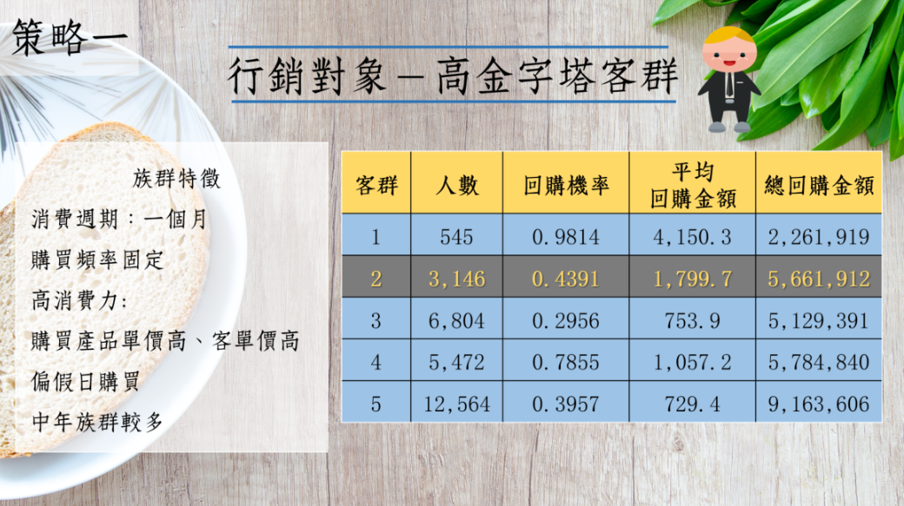
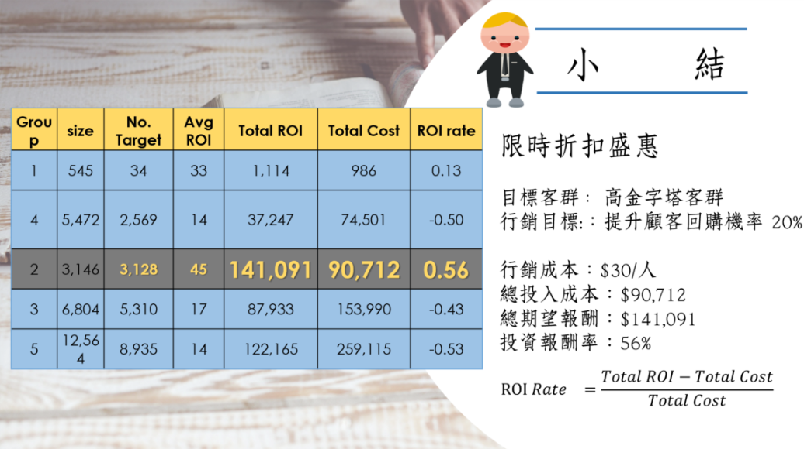

<center>


</center>
<br>
```{r}
rm(list=ls(all=T))
options(digits=4, scipen=12)
pacman::p_load(ggplot2, manipulate, dplyr, latex2exp)
load("data/tf3.rdata")
```

### 行銷策略設計

##### 行銷對象

<center>



</center>

選定行銷對象為**高金字塔客群**

+ 族群特徵:
  + 消費週期約為一個月，前三個月的購買頻率也很固定
  + 高消費力: 購買產品單價高、客單價高
  + 偏假日購買
  + 中年族群較多

+ 原因:
  + 第二群的平均回購機率約0.44，有一段空間可以讓行銷工具來發揮。
  + 總預期購買金額大，值得投資工具
  + 此客群的特徵明顯，容易來做行為市場區隔
  + 消費週期約為一個月，前三個月的購買頻率也很固定
  + 高消費力: 購買產品單價高、客單價高
  + 偏假日購買
  + 中年族群較多


##### 行銷方案

對此客群我們設計的行銷方案為**限時折扣盛惠**

針對我們的高金字塔群發送折扣優惠券，且將時限設為三月以前

**目標**：

提升約 20%的三月回購機率，從原本的 44% 變到64%


寄送折扣券成本假設為 $1


```{r}
D %>% 
  group_by(grp) %>% 
  summarise(
    size = n(),
    AvgBuy = mean(Buy),
    AvgRev = mean(Rev),
    TotalRev = sum(Rev)
)
```


<br><br><hr><br>


### 模擬成本與效果


##### 假設：固定成本、增加回購機率($k_2$)

現在要來探討，優惠券的折扣要折扣多少錢才能有足夠的吸引力讓顧客回購機率提升，我們商店又能得到最大的效益且不虧錢?

優惠券的發送成本為 $1

獲利率: 

$MRG = \frac{price - cost}{price} = 0.1805$

淨期望報酬：

$\pi = MRG \cdot R_{exp} \cdot \Delta P_{ret} - c \cdot (P_{retain} + \Delta P_{ret}) - c_{0}$


回購機率增額： 

$$\Delta P_{ret} = \left\{\begin{matrix}
k_2 & P_{retain}<=1-k_2 \\ 
1-P_{retain} & else 
\end{matrix}\right.$$

我們計算第二群的平均營業獲利率為0.1805
```{r}
MRG = 0.1805
```

##### 帶有參數的函數

我們用成本效益函數來看，優惠券的面額(折扣多少錢)要選擇多少才能發揮作用

假設成本效益函數長這樣
+ m: 最高點 (回購機率增額) 0.2
+ b: 中心點 (有吸引力的折扣價) 25
+ a: 變動範圍 20

因為我們客群是屬於高消費力客群，如果折價金額太小可能無法吸引顧客，所以我們將B(中心點)假設為$20


$$k_0=f(x)=m \cdot Logis[10(x - b)/a]$$

```{r eval=FALSE}
manipulate({
  curve(m*plogis((10/a)*(x-b)), 0, 30, lwd=2, ylim=c(0, 0.25),
        main = TeX('$m \\cdot Logis(10(x - b)/a)$'), ylab="f(x)")
  abline(h=seq(0,0.2,0.05),v=seq(0,30,5),col='lightgrey',lty=2)
},
m = slider(0.05, 0.35,  0.20, step=0.01),
a = slider(  10,   40,    25, step=1),
b = slider(   4,   40,    20, step=1)
) 
```


##### 使用模擬方法找到最佳策略(參數)

在我們給定mba三個參數的成本效益函數之下，我們可以計算每一群執行行銷工具所得到的預期報酬與成本關係圖

如果實行限時折扣盛惠的活動，第五群的潛力顧客可以得到最大的總預期報償，而對於第一群忠誠顧客的效益最少

看看第二群的線可以發現，如果我們想獲得最大的預期報酬，工具成本的投入約為 $29

所以我們可以大概決定我們的優惠折扣為 $29


```{r}
m=0.20; a=25; b=20
do.call(rbind, lapply(seq(5,50,0.5), function(c){
  p = m*plogis((10/a)*(c-b))
  D %>% mutate(
    PI = MRG*ifelse(Buy<=(1-p), p, 1-Buy) * Rev - c*ifelse(Buy<=(1-p), Buy+p, 1) - 1
  ) %>%
    group_by(grp) %>% summarise(
      Cost = c,
      Group.Sz = n(),
      No.Target = sum(PI>0),
      AvgROI = mean(PI[PI>0]),
      TotalROI = sum(PI[PI>0])
    ) } ) ) %>% 
  ggplot(aes(x=Cost, y=TotalROI, col=factor(grp))) +
  geom_line(size=1.2) +
  ggtitle("Cost Effeciency per Segment ")
```
<br>

`manipulate()`不能在Rmd直接執行，需要另外開一個R窗格，把以下程式碼Copy過去跑
```{r eval=F}
manipulate({
  do.call(rbind, lapply(seq(5,50,0.5), function(c){
    p = m*plogis((10/a)*(c-b))
    D %>% mutate(
      PI = MRG*ifelse(Buy<=(1-p), p, 1-Buy) * Rev - c*ifelse(Buy<=(1-p), Buy+p, 1) - 1
    ) %>%
      group_by(grp) %>% summarise(
        Cost = c,
        Group.Sz = n(),
        No.Target = sum(PI>0),
        AvgROI = mean(PI[PI>0]),
        TotalROI = sum(PI[PI>0])
      ) } ) ) %>% 
    ggplot(aes(x=Cost, y=TotalROI, col=factor(grp))) +
    geom_line(size=1.2) +
    ggtitle("Cost Effeciency per Segment ")
},
m = slider(0.05, 0.25,  0.20, step=0.01),
a = slider(  10,   30,    25, step=1),
b = slider(  10,   50,   20, step=5)
) 
```


##### 最佳策略

+ 回購機率增額為0.2
+ 成本投入最佳為 $29
+ 再加上寄送優惠券成本 $1
```{r}
k2=0.2; cost=29
```

```{r}
options(digits = 2)
D = D %>% mutate(
  PI = MRG*Rev*ifelse(Buy<=(1-k2), k2, 1-Buy) - cost*ifelse(Buy<=(1-k2), Buy+k2, 1) - 1
  ) 
D %>% group_by(grp) %>% 
  summarise(
    Group.Sz = n(),
    No.Target = sum(PI>0),              # 目標對象
    AvgROI = mean(PI[PI>0]),
    TotalROI = sum(PI[PI>0]),           # 淨期望報酬
    TotalCost = No.Target*cost,         # 投入的總成本
    ROIrate = (TotalROI-TotalCost)/TotalCost) %>%   # 投資報酬率 
  arrange(No.Target) %>% 
  data.frame
```

##### 工具在各族群的淨期望報償分布
```{r fig.height=8, fig.width=7}
par(mfrow=c(4,2), mar=c(4,3,3,2), cex=0.8)
for(s in c("1","2","3","4","5")) {
  hist(D$PI[D$grp==s], xlim=c(-40, 400),  
        breaks=seq(-1000,1000,20), main=s, xlab="exp.profit")
  abline(v=0, col='green', lty=2)}
```

<br><br><hr><br>

### 小結

我們來比較一下”限時折扣盛惠”對於每個群的成本、報酬與投資報酬率

可以發現這個優惠活動對於第二群的高金字塔客群來說非常適合

+ 我們找出此群的3,128人做為目標行銷對象
+ 平均每個對象的淨期望報酬為 $45
+ 總淨期望報酬約為14萬元，是五群中最高
+ 我們需要投入的成本約為9萬元
+ 這樣的”限時折扣盛惠”活動針對第二客群來進行，可以得到最高的投資報酬率 56%

看到如此吸引人的數字，各位老闆們，只要花費約九萬元來對高金字塔客群做行銷，
我們就能提高20%的回購機率，並得到14萬元的期望報酬!


<center>



</center>


<br><br><br>


