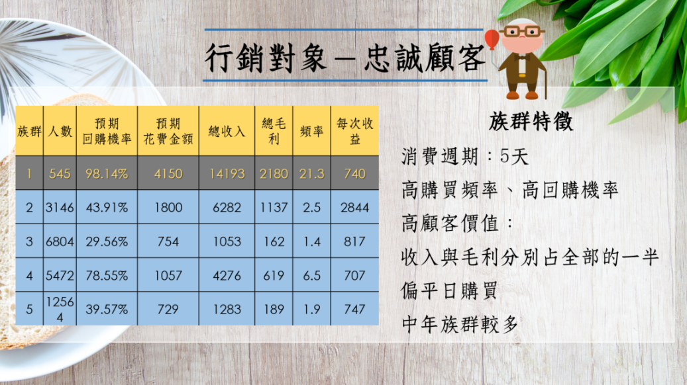
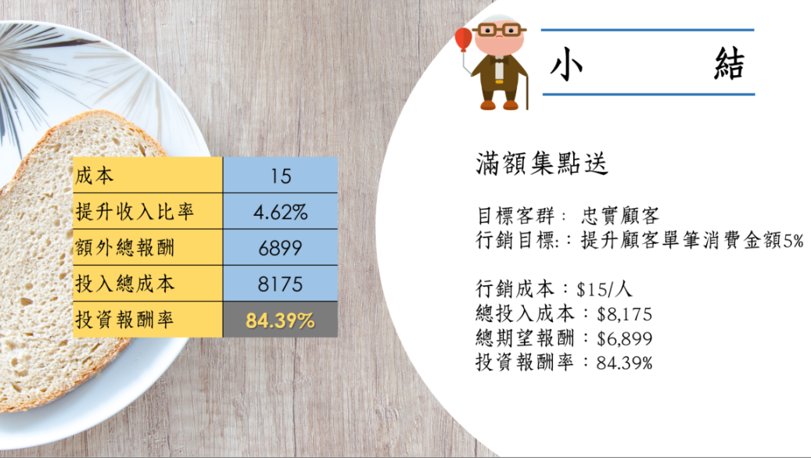
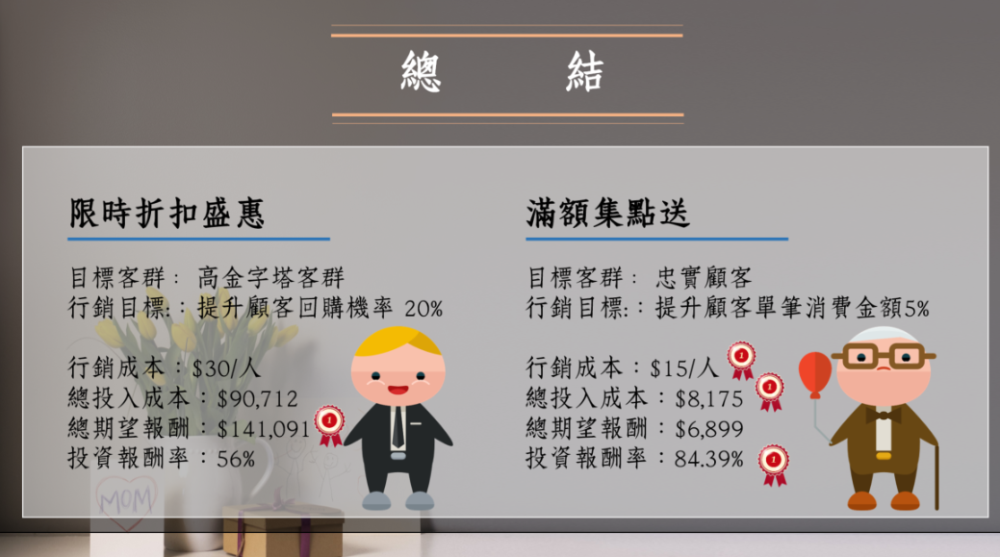

<center>


</center>


### 行銷策略模擬
##### Library
```{r}
rm(list=ls(all=T))
options(digits=4, scipen=12)
pacman::p_load(ggplot2, manipulate, dplyr, latex2exp)
load("data/tf3.rdata")
```

##### 1. 不同客戶群其成本收益與預測結果
```{r}
P = group_by(D, grp) %>% summarise(
  size=n(),                          ## 族群大小
  buyProb=mean(Buy),                 ## 預測3月會回購的機率
  revPred=mean(Rev),                 ## 預測3月會花費多少
  totalRev=mean(rev),                ## 總收入
  totalCost=mean(rev-raw),           ## 總成本
  totalProfit=mean(raw),             ## 總毛利
  costRate=mean((rev-raw)/rev),      ## 成本率
  profitRate=mean(raw/rev),          ## 毛利率
  freq=mean(f),                      ## 頻率
  avgRev=mean(rev/f),                ## 平均每次消費收入
  avgCost=mean((rev-raw)/f),         ## 平均每次消費成本
  avgProfit=mean(raw/f)              ## 平均每次消費利潤
  ) 
P
```

##### 2. 針對第一個族群(忠誠顧客)進行的行銷策略

<center>



</center>


本族群其特性為:<br>
1. 常常平日來買<br>
2. 老顧客<br>
3. 中老年偏多<br>
4. 大都住在114與221<br>
5. 容易受到節慶影響<br>
6. 常購買熱銷產品<br>

```{r}
data.frame(group=1:5, size=P$size/sum(P$size),
           totalRev=P$totalRev/sum(P$totalRev),
           totalProfit=P$totalProfit/sum(P$totalProfit))
```

可以發現第一群的族群數較少(只占2%)<br>
但本商店的收入與利潤來源有超過一半(52%與51%)是來自於該族群<br>
影響力之大，不可忽視<hr>

設計一個行銷策略：<br>
由於該族群的顧客常常來買，因此可以設計一個集點卡累積的活動<br>
每當消費金額超過一個設定值，即可獲得1點，集滿10點可以兌換獎品<br>
利用此方式來**提升單筆消費金額**，對於忠誠顧客來說也是一種回饋<hr>

預測回購機率:0.981<br>
預測收益:4150<br>
成本率:85.4%<br>
毛利率:14.6%<br>
```{r}
G1 = subset(D, grp=="1")
profitRate=0.146
P0=G1$Buy
R0=G1$Rev
```


##### 策略模擬

假設此策略的實施最高能提升5%的收入，能接受的成本範圍介於0到20之間
透過模擬能觀察到成本與效果之間的關係，如下圖所示
x軸為成本，y軸則為提升收入的比率
不同的成本所對應的效果會不一樣


使用模擬方法找到最佳策略(參數)
假設：
1. 此策略最高能提升5%的收入(m=0.05)
2. 成本的中心點為10(b=10)
3. 成本前後範圍為20(a=20)
```{r}
m=0.05; a=20; b=10
curve(m*plogis((10/a)*(x-b)), 0, 30, lwd=2, ylim=c(0, 0.06), ylab="f(x)")
abline(h=seq(0,0.2,0.05),v=seq(0,30,5),col='lightgrey',lty=2)
```

##### 策略報酬

接著，以此方式進一步來模擬當策略真正的實施下，投入的成本多寡所能獲得的額外報酬為何，如第一條式子

假設固定回購機率、花費金額以及毛利率14.6%

其結果如圖所示，呈現不同投入的成本所對應的額外報酬

根據此圖我們挑選最佳的參數也就是成本為15來做為策略的實施

```{r}
m=0.05; a=20; b=10
c = seq(0,25,0.5)
p = m*plogis((10/a)*(c-b))
totalRoI = c()
for(i in 1:length(c)){
  totalRoI = rbind(totalRoI, sum(P0*R0*p[i]*profitRate-c[i]))
}
roiRange = data.frame(cost=c, totalRoI=totalRoI)
roiRange %>% ggplot(aes(x=cost, y=totalRoI)) +
  geom_line(size=1.2) +
  ggtitle("Cost Effeciency per Segment ")
```

計算額外報酬、總成本以及ROI
```{r}
m=0.05; a=20; b=10
cost = 15
increasingRate = m*plogis((10/a)*(cost-b))
returnTotal = sum(P0*R0*increasingRate*profitRate-cost)
costTotal = length(P0)*cost
data.frame(cost=cost, increasingRate=increasingRate, returnTotal=returnTotal, costTotal=costTotal, ROI=returnTotal/costTotal)
```


<br><hr>


### 小結

<center>



</center>

### 行銷方案總結論

<center>



</center>


<br><br><br>


